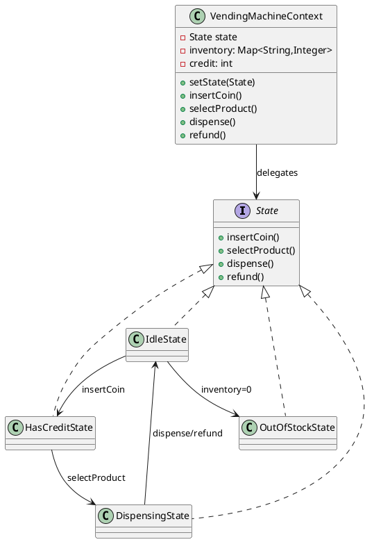

# State — Behavioral Design Pattern (GoF)

## Pattern Name and Classification

**State** — Behavioral pattern.

## Intent

Let an object alter its behavior when its internal state changes. The object will appear to change its class.

## Also Known As

Objects for States; State Machine (OO flavor); “Switch killer” (informal).

## Motivation (Forces)

-   You have an object whose behavior depends on a finite set of modes (states) and changes at runtime.

-   You want to **eliminate complex conditionals** (`if/else`, `switch`) scattered across many methods.

-   You need to **localize state-specific behavior and transitions** to keep the code maintainable and open for new states without modifying existing logic (Open–Closed Principle).

-   You may want to **share state instances** (stateless or immutable) and **guard transitions**.


## Applicability

Use **State** when:

-   An object’s behavior depends on its state, and it must change behavior at runtime.

-   Operations have large conditional branches that depend on the object’s state.

-   You want to model a state machine with clearly encapsulated transitions and actions.

-   You need to add new states without touching the context’s core logic.


## Structure

A context delegates work to a current `State`. States can transition the context to other states.



## Participants

-   **Context**: holds a reference to a `State` instance; exposes the API; delegates requests to the current state; may hold shared data (e.g., credit, inventory).

-   **State (interface/abstract class)**: declares state-specific operations; may have default no-ops or guards.

-   **ConcreteState**: implements behavior for a state; can change the context’s current state.


## Collaboration

-   Client talks to **Context** only.

-   Context forwards calls to the **current State**.

-   **ConcreteState** may update the **Context** (e.g., `context.setState(...)`) and mutate shared data.

-   States can be **singletons** if stateless, or they may keep ephemeral, state-local data if needed.


## Consequences

**Pros**

-   Replaces sprawling conditionals with **polymorphism**.

-   **Localizes** state-specific code and transitions → improved cohesion.

-   **Open–Closed**: add new states without editing existing ones.

-   Enables **state instance reuse** and testability.


**Cons**

-   **More classes** (one per state).

-   Transitions spread across states can be harder to **see globally** (mitigate with a transition table or documentation).

-   If states need lots of shared mutable data, you must manage **thread safety** carefully.


## Implementation

**Key steps**

1.  Identify state-dependent operations and extract them into a `State` interface.

2.  Let the **Context** own the shared data and the current `State`.

3.  Implement **ConcreteState** classes; each performs behavior and decides transitions.

4.  Prefer **composition over inheritance** for shared helpers.

5.  If states are immutable/stateless, use **singletons** to avoid allocations.

6.  Consider an explicit **transition API** or **guard methods** to centralize rules if necessary.

7.  For concurrency:

    -   Keep **Context**’s mutable data confined; synchronize at the context level or use lock-free atomics where appropriate.

    -   Transitions (`setState`) should be **atomic** relative to operations.

8.  Persistence / restart: store a **state identifier** and reconstruct on load.

9.  If you need global visibility of the machine, generate a **state diagram** from a transition table (or keep a declarative map for testing).


**Variations**

-   **Enum-based state** (small FSMs): use `enum` with behavior (`abstract` methods per constant).

-   **Table-driven FSM**: map `(state, event) -> (action, nextState)`.

-   **Hierarchical state machines** (HSM): factor shared behavior in super-states (outside GoF but useful for complex UIs).


## Sample Code (Java)

Below is a concise but realistic vending machine. It models credit, inventory, and transitions. Java 8+.

```java
// State.java
public interface State {
    void insertCoin(VendingMachine ctx, int amount);
    void selectProduct(VendingMachine ctx, String sku);
    void dispense(VendingMachine ctx);
    void refund(VendingMachine ctx);
}

// VendingMachine.java (Context)
import java.util.Collections;
import java.util.HashMap;
import java.util.Map;

public class VendingMachine {
    private volatile State state;
    private final Map<String, Integer> inventory; // sku -> quantity
    private final Map<String, Integer> prices;    // sku -> price (cents)
    private int credit; // cents

    public VendingMachine(Map<String, Integer> inventory, Map<String, Integer> prices) {
        this.inventory = new HashMap<>(inventory);
        this.prices = new HashMap<>(prices);
        this.state = isOutOfStock() ? OutOfStockState.INSTANCE : IdleState.INSTANCE;
    }

    // Public API delegates to state. Synchronize to keep transitions atomic.
    public synchronized void insertCoin(int amount) { state.insertCoin(this, amount); }
    public synchronized void selectProduct(String sku) { state.selectProduct(this, sku); }
    public synchronized void dispense() { state.dispense(this); }
    public synchronized void refund() { state.refund(this); }

    // Context helpers (package-private)
    void setState(State s) { this.state = s; }
    State getState() { return state; }
    int getCredit() { return credit; }
    void addCredit(int delta) { credit += delta; }
    void resetCredit() { credit = 0; }
    boolean hasSku(String sku) { return inventory.getOrDefault(sku, 0) > 0; }
    int priceOf(String sku) { return prices.getOrDefault(sku, Integer.MAX_VALUE); }
    void decrement(String sku) { inventory.computeIfPresent(sku, (k,v) -> Math.max(v-1, 0)); }
    boolean isOutOfStock() { return inventory.values().stream().mapToInt(i -> i).sum() == 0; }
    Map<String,Integer> snapshotInventory() { return Collections.unmodifiableMap(inventory); }
}
```

```java
// IdleState.java
public final class IdleState implements State {
    public static final IdleState INSTANCE = new IdleState();
    private IdleState() {}

    @Override public void insertCoin(VendingMachine ctx, int amount) {
        if (amount <= 0) return;
        ctx.addCredit(amount);
        ctx.setState(HasCreditState.INSTANCE);
        System.out.println("Credit: " + ctx.getCredit() + " cents.");
    }

    @Override public void selectProduct(VendingMachine ctx, String sku) {
        System.out.println("Insert coin first.");
    }

    @Override public void dispense(VendingMachine ctx) {
        System.out.println("Nothing to dispense.");
    }

    @Override public void refund(VendingMachine ctx) {
        System.out.println("No credit to refund.");
    }
}
```

```java
// HasCreditState.java
public final class HasCreditState implements State {
    public static final HasCreditState INSTANCE = new HasCreditState();
    private HasCreditState() {}

    @Override public void insertCoin(VendingMachine ctx, int amount) {
        if (amount <= 0) return;
        ctx.addCredit(amount);
        System.out.println("Credit: " + ctx.getCredit() + " cents.");
    }

    @Override public void selectProduct(VendingMachine ctx, String sku) {
        if (!ctx.hasSku(sku)) {
            System.out.println("Out of selected product.");
            if (ctx.isOutOfStock()) ctx.setState(OutOfStockState.INSTANCE);
            return;
        }
        int price = ctx.priceOf(sku);
        if (ctx.getCredit() < price) {
            System.out.println("Insufficient credit. Price: " + price);
            return;
        }
        // Reserve product and transition
        ctx.decrement(sku);
        ctx.setState(new DispensingState(sku, price)); // state with ephemeral data
        System.out.println("Dispensing " + sku + "...");
    }

    @Override public void dispense(VendingMachine ctx) {
        System.out.println("Select product first.");
    }

    @Override public void refund(VendingMachine ctx) {
        int refund = ctx.getCredit();
        ctx.resetCredit();
        ctx.setState(IdleState.INSTANCE);
        System.out.println("Refunded " + refund + " cents.");
    }
}
```

```java
// DispensingState.java
public final class DispensingState implements State {
    private final String sku;
    private final int price;

    public DispensingState(String sku, int price) {
        this.sku = sku;
        this.price = price;
    }

    @Override public void insertCoin(VendingMachine ctx, int amount) {
        System.out.println("Busy dispensing. Please wait.");
    }

    @Override public void selectProduct(VendingMachine ctx, String sku) {
        System.out.println("Already dispensing.");
    }

    @Override public void dispense(VendingMachine ctx) {
        // Complete transaction
        int change = ctx.getCredit() - price;
        ctx.resetCredit();
        ctx.setState(ctx.isOutOfStock() ? OutOfStockState.INSTANCE : IdleState.INSTANCE);
        System.out.println("Enjoy your " + sku + "! Change: " + change + " cents.");
    }

    @Override public void refund(VendingMachine ctx) {
        System.out.println("Cannot refund while dispensing.");
    }
}
```

```java
// OutOfStockState.java
public final class OutOfStockState implements State {
    public static final OutOfStockState INSTANCE = new OutOfStockState();
    private OutOfStockState() {}

    @Override public void insertCoin(VendingMachine ctx, int amount) {
        System.out.println("Machine is out of stock. Refunding: " + amount + " cents.");
    }

    @Override public void selectProduct(VendingMachine ctx, String sku) {
        System.out.println("Out of stock.");
    }

    @Override public void dispense(VendingMachine ctx) {
        System.out.println("Nothing to dispense.");
    }

    @Override public void refund(VendingMachine ctx) {
        int refund = ctx.getCredit();
        ctx.resetCredit();
        System.out.println("Refunded " + refund + " cents.");
    }
}
```

```java
// Demo.java
import java.util.Map;

public class Demo {
    public static void main(String[] args) {
        VendingMachine vm = new VendingMachine(
            Map.of("COKE", 2, "WATER", 1),
            Map.of("COKE", 150, "WATER", 100)
        );

        vm.insertCoin(100);
        vm.selectProduct("COKE"); // insufficient
        vm.insertCoin(100);
        vm.selectProduct("COKE"); // reserved & go to Dispensing
        vm.dispense();            // completes, outputs change

        vm.insertCoin(100);
        vm.refund();              // back to Idle
    }
}
```

**Notes**

-   `DispensingState` is **not a singleton** because it carries ephemeral data (sku, price).

-   Context methods are `synchronized` to keep transitions atomic; in highly concurrent scenarios consider finer-grained locks or a single-threaded actor.


## Known Uses

-   **TCP connection** handling (CLOSED, LISTEN, SYN\_SENT, ESTABLISHED, …).

-   **UI widgets** with modes: enabled/disabled/hovered/pressed.

-   **Parsers** and tokenizers transitioning between modes (e.g., string literal vs code).

-   **Workflow engines**: order lifecycle (Draft → Submitted → Approved → Shipped → Delivered/Cancelled).

-   **Games**: character states (Idle, Running, Jumping, Attacking, Stunned).


## Related Patterns

-   **Strategy**: similar structure (polymorphism) but strategies are chosen by clients; **State** transitions are driven by the context and model life cycle.

-   **Singleton**: concrete states can be singletons if stateless.

-   **Flyweight**: reuse state instances across contexts to save memory.

-   **Memento**: capture/restore a context’s state (undo).

-   **Observer**: notify interested parties on state changes.

-   **Interpreter** / **Table-driven FSMs**: alternative ways to express complex machines; can coexist with State for clarity.
