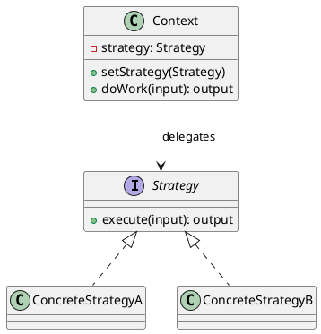

# Strategy — Behavioral Design Pattern (GoF)

## Pattern Name and Classification

**Strategy** — Behavioral pattern.

## Intent

Define a family of algorithms, encapsulate each one, and make them interchangeable. Strategy lets the algorithm vary independently from clients that use it.

## Also Known As

Policy; Interchangeable Algorithms; Family of Algorithms.

## Motivation (Forces)

-   You need to support **multiple algorithms** that can be swapped at runtime (e.g., different pricing rules, routing heuristics, compression formats).

-   You want to **separate behavior from selection** logic and avoid giant `switch`/`if-else` chains scattered across the codebase.

-   You want to keep the **Context** stable while new algorithms can be added with minimal impact (Open–Closed Principle).

-   Algorithms may have **different trade-offs** (time/space/compliance/precision) and **different configuration** needs.

-   You want **testability**: mock or unit-test each algorithm in isolation.


## Applicability

Use **Strategy** when:

-   You have many related classes that differ only in their behavior.

-   You need different **variants** of an algorithm (e.g., different sorting, caching, pricing).

-   You want to **hide algorithmic complexity** behind a simple, stable interface.

-   You need to **choose an algorithm at runtime** (user preference, feature flag, A/B test, config).

-   You want to **avoid subclassing** the Context just to change behavior.


## Structure

The Context delegates work to a `Strategy` interface implemented by multiple concrete strategies.



## Participants

-   **Strategy (interface/abstract class)**: declares the common algorithm interface.

-   **ConcreteStrategy**: implements a particular algorithm variant.

-   **Context**: holds a `Strategy` reference and delegates to it; may provide the data the strategy needs.


## Collaboration

-   Client configures the **Context** with a **Strategy** (constructor, setter, DI container, or factory).

-   **Context** forwards calls to the current Strategy and may pass additional data.

-   Strategies are typically **stateless** (safe to reuse) but may hold configuration if needed.


## Consequences

**Pros**

-   Eliminates conditional logic for algorithm selection.

-   Encourages **composition over inheritance**; new algorithms don’t modify the Context.

-   Improves **testability** and **SRP**: each algorithm lives in its own class.

-   Enables **runtime switching** and **feature-flagging**.


**Cons**

-   **More classes** (one per algorithm) unless you use lambdas.

-   Clients must understand **differences** between strategies to choose appropriately.

-   Potential **overhead** for trivial behavior (interface call, allocation) — usually negligible in modern JVMs.

-   If a Strategy needs lots of data, you must decide **where it lives** (pass as parameters vs. store in Context).


## Implementation

**Key steps**

1.  Extract the variable behavior into a `Strategy` interface with a **cohesive** method signature.

2.  Implement each algorithm in a `ConcreteStrategy`.

3.  Let the **Context** accept a Strategy (constructor/setter) and **delegate** to it.

4.  For small or one-off algorithms, consider **lambdas** or **enum-with-behavior** to avoid class explosion.

5.  For DI-heavy systems, register strategies and select by **name/qualifier** or through a factory.

6.  Make strategies **stateless** when possible; share instances (Singleton/Flyweight) safely.

7.  If strategies need configuration: pass config objects or use **builder/factory** methods.

8.  Consider a **Null Object** strategy for default/no-op behavior.

9.  For performance-sensitive code, avoid excessive allocations; **reuse** strategy instances.


**Variations**

-   **Functional Strategy** (Java 8+): use `Function<T,R>`, `Predicate<T>`, etc., or custom `@FunctionalInterface`.

-   **Enum Strategy**: each enum constant overrides behavior.

-   **Composite Strategy**: combine multiple strategies (chain them).

-   **Strategy Registry**: map keys -> strategies for discovery by config/feature flag.


## Sample Code (Java)

### Example domain: Pricing with multiple discount policies

We’ll create interchangeable discount strategies and a context that applies them.

```java
// DiscountStrategy.java
@FunctionalInterface
public interface DiscountStrategy {
    /**
     * @param originalPrice price before discount (in cents)
     * @param customerTier  e.g., "STANDARD", "GOLD", "STUDENT"
     * @param itemsInCart   number of items
     * @return discounted price (in cents), never negative
     */
    long apply(long originalPrice, String customerTier, int itemsInCart);

    static long clampNonNegative(long value) {
        return Math.max(0, value);
    }
}
```

```java
// NoDiscount.java
public final class NoDiscount implements DiscountStrategy {
    public static final NoDiscount INSTANCE = new NoDiscount();
    private NoDiscount() {}
    @Override
    public long apply(long originalPrice, String tier, int items) {
        return originalPrice;
    }
}
```

```java
// PercentageDiscount.java
public final class PercentageDiscount implements DiscountStrategy {
    private final int percent; // 0..100
    public PercentageDiscount(int percent) {
        if (percent < 0 || percent > 100) throw new IllegalArgumentException("percent 0..100");
        this.percent = percent;
    }
    @Override
    public long apply(long originalPrice, String tier, int items) {
        long discounted = originalPrice - (originalPrice * percent) / 100;
        return DiscountStrategy.clampNonNegative(discounted);
    }
}
```

```java
// TieredDiscount.java
import java.util.Map;

public final class TieredDiscount implements DiscountStrategy {
    private final Map<String,Integer> percentByTier; // e.g., GOLD->15, STUDENT->10
    public TieredDiscount(Map<String,Integer> percentByTier) {
        this.percentByTier = Map.copyOf(percentByTier);
    }
    @Override
    public long apply(long originalPrice, String tier, int items) {
        int p = percentByTier.getOrDefault(tier, 0);
        long discounted = originalPrice - (originalPrice * p) / 100;
        return DiscountStrategy.clampNonNegative(discounted);
    }
}
```

```java
// BulkDiscount.java
public final class BulkDiscount implements DiscountStrategy {
    private final int threshold;
    private final int percent;
    public BulkDiscount(int threshold, int percent) {
        this.threshold = threshold;
        this.percent = percent;
    }
    @Override
    public long apply(long originalPrice, String tier, int items) {
        long discounted = items >= threshold
                ? originalPrice - (originalPrice * percent) / 100
                : originalPrice;
        return DiscountStrategy.clampNonNegative(discounted);
    }
}
```

```java
// PricingContext.java
public class PricingContext {
    private DiscountStrategy strategy;

    public PricingContext(DiscountStrategy strategy) {
        this.strategy = strategy;
    }
    public void setStrategy(DiscountStrategy strategy) {
        this.strategy = strategy;
    }

    public long price(long originalPrice, String customerTier, int itemsInCart) {
        return strategy.apply(originalPrice, customerTier, itemsInCart);
    }
}
```

```java
// Demo.java
import java.util.Map;

public class Demo {
    public static void main(String[] args) {
        PricingContext ctx = new PricingContext(NoDiscount.INSTANCE);

        long base = 10_00; // €10.00 as cents
        System.out.println("No discount: " + ctx.price(base, "STANDARD", 1)); // 1000

        ctx.setStrategy(new PercentageDiscount(20));
        System.out.println("20%: " + ctx.price(base, "STANDARD", 1)); // 800

        ctx.setStrategy(new TieredDiscount(Map.of("GOLD", 15, "STUDENT", 10)));
        System.out.println("GOLD: " + ctx.price(base, "GOLD", 1)); // 850

        ctx.setStrategy(new BulkDiscount(5, 12));
        System.out.println("Bulk(5+,12%): " + ctx.price(base, "STANDARD", 7)); // 880

        // Lambda-based strategy for promotional “flat €2 off, floor at zero”
        ctx.setStrategy((orig, tier, items) -> Math.max(0, orig - 2_00));
        System.out.println("Promo flat €2 off: " + ctx.price(base, "ANY", 2)); // 800
    }
}
```

**Notes**

-   Strategies here are **immutable/stateless**, hence safe to **reuse** across threads.

-   The interface is **functional**, so you can plug in lambdas or method references.

-   Representing money as **cents** avoids floating-point rounding issues (use `BigDecimal` if you must handle VAT precisely).


### Optional: Enum Strategy (compact)

```java
public enum ShippingCost implements DiscountStrategy {
    ECONOMY { public long apply(long p, String t, int n) { return p + 399; } },
    EXPRESS { public long apply(long p, String t, int n) { return p + 999; } };
}
```

## Known Uses

-   **Java Collections**: `Comparator` as a sorting strategy passed to `Collections.sort` / `List.sort`.

-   **Spring**: many SPI interfaces (e.g., `ConversionService`, `TaskScheduler`) accept pluggable implementations.

-   **Payment** modules: different providers/selectors (Stripe, Adyen, PayPal) as strategies.

-   **Compression/serialization**: choose between GZIP, LZ4, Snappy, JSON, CBOR, Avro.

-   **Routing**: shortest-path heuristics (Dijkstra, A\*, bidirectional search) as interchangeable strategies.

-   **Cache eviction**: LRU, LFU, ARC.


## Related Patterns

-   **State**: similar class diagram, but **State** transitions depend on internal state changes; **Strategy** is selected by clients/config.

-   **Template Method**: fixed algorithm skeleton with overridable steps; **Strategy** composes, Template inherits.

-   **Factory Method / Abstract Factory**: produce strategies based on configuration.

-   **Decorator**: wrap a strategy to add behavior (metrics, logging, caching) without changing it.

-   **Bridge**: separates abstraction from implementation; you can place a Strategy on one side of the bridge.
