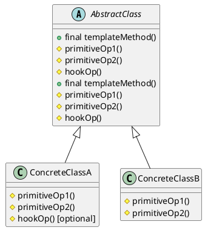

# Template Method — Behavioral Design Pattern (GoF)

## Pattern Name and Classification

**Template Method** — Behavioral pattern.

## Intent

Define the **skeleton of an algorithm** in an operation, deferring some steps to subclasses. Template Method lets subclasses redefine certain steps of an algorithm without changing its overall structure.

## Also Known As

-   **Hollywood Principle** (“Don’t call us, we’ll call you.”)

-   **Algorithm Skeleton**

-   **Invariant/Variant Decomposition**


## Motivation (Forces)

-   You have several algorithms that share the **same overall sequence** of steps but differ in **some details**.

-   You want to **avoid code duplication** across these algorithms while keeping the **high-level flow stable**.

-   You need **controlled extensibility**: allow customization points but protect the algorithm’s invariants.

-   You prefer **inversion of control** (the framework calls user code at well-defined points).


## Applicability

Use Template Method when:

-   Multiple classes perform the **same workflow** with **different step implementations** (e.g., parsing, exporting, authentication flows).

-   You want to **fix the order** of operations but make **some steps optional** (hooks) or customizable.

-   You need to **enforce invariants** around the algorithm (transaction boundaries, auditing, resource cleanup).


## Structure

The abstract class provides the template method (final) calling primitive operations and hooks.



## Participants

-   **AbstractClass**: defines the **template method** that implements the algorithm skeleton; declares **primitive operations** and **hooks** to be supplied/overridden by subclasses.

-   **ConcreteClass**: implements the primitive operations to carry out subclass-specific steps; optionally overrides hooks.


## Collaboration

-   Clients call the **template method** on the abstract class (usually exposed via subclass instance).

-   The template method invokes subclass-provided steps (primitive operations) and optional hooks in a **fixed order**.

-   Subclasses **do not change** the algorithm’s structure; they only supply behavior for the varying parts.


## Consequences

**Pros**

-   **Code reuse**: common flow lives once in the abstract base.

-   **Enforced invariants**: ordering and required steps cannot be broken (make template `final`).

-   **Controlled extensibility** via **hooks** (optional steps with default no-op).

-   Reduces duplication vs. copy-paste variants.


**Cons**

-   **Inheritance coupling**: variations must subclass the abstract class (less flexible than composition).

-   Can lead to **fragile base class** problems if the base evolves without care.

-   Too many hooks/primitive ops can turn the base into a **god class**.

-   Harder to vary behavior **at runtime** compared to Strategy.


## Implementation

**Guidelines**

1.  Put the **invariant workflow** in `templateMethod()` and mark it **`final`**.

2.  Identify **primitive operations** (abstract or protected) that must be supplied by subclasses.

3.  Provide **hooks**: protected methods with **default implementations** (often no-op) for optional variation.

4.  Keep **data and side effects** needed by steps as fields of the abstract class; pass only what varies.

5.  Ensure **exception safety**: wrap steps with try/finally if resources must be released.

6.  Document **pre/postconditions** for each primitive operation.

7.  For testability, you can:

    -   Test each **concrete** subclass independently.

    -   Add **protected getters** or package-private access for verifications.

8.  **Concurrency**: if the template mutates shared state, ensure thread confinement or synchronization at the **template level**, not inside scattered steps.


**Variations**

-   **Template + Strategy**: keep the skeleton in the template; delegate some steps to **pluggable strategies** instead of requiring subclasses.

-   **Self-registration hook**: a hook that registers metrics/logging.

-   **Functional hooks** (Java 8+): hooks accept lambdas.


## Sample Code (Java)

### Domain: Data export pipeline

Common skeleton: load → transform → validate (hook) → write → afterWrite (hook)

```java
// AbstractDataExporter.java
import java.util.List;

public abstract class AbstractDataExporter<T> {

    // The template method — fixed algorithm
    public final void export() {
        List<T> items = load();
        List<T> transformed = transform(items);
        if (!validate(transformed)) {
            onValidationFailed(transformed);
            return;
        }
        write(transformed);
        afterWrite(transformed); // optional hook
    }

    // Primitive operations (must be implemented)
    protected abstract List<T> load();
    protected abstract List<T> transform(List<T> input);
    protected abstract void write(List<T> items);

    // Hooks (optional to override)
    protected boolean validate(List<T> items) { return true; }
    protected void onValidationFailed(List<T> items) { /* default: no-op */ }
    protected void afterWrite(List<T> items) { /* default: no-op */ }
}
```

```java
// CsvUserExporter.java
import java.util.*;
import java.util.stream.Collectors;

public class CsvUserExporter extends AbstractDataExporter<User> {

    @Override
    protected List<User> load() {
        // Pretend DB fetch
        return List.of(
            new User("alice@example.com", "Alice", true),
            new User("bob@example.com", "Bob", false)
        );
    }

    @Override
    protected List<User> transform(List<User> input) {
        // Normalize names, filter inactive
        return input.stream()
            .filter(User::active)
            .map(u -> new User(u.email(), capitalize(u.name()), u.active()))
            .collect(Collectors.toUnmodifiableList());
    }

    @Override
    protected boolean validate(List<User> items) {
        // All emails must contain '@'
        return items.stream().allMatch(u -> u.email().contains("@"));
    }

    @Override
    protected void onValidationFailed(List<User> items) {
        System.err.println("Validation failed: " + items);
    }

    @Override
    protected void write(List<User> items) {
        // Write CSV to stdout for demo
        System.out.println("email,name,active");
        items.forEach(u -> System.out.println(
            String.join(",", u.email(), u.name(), Boolean.toString(u.active()))));
    }

    @Override
    protected void afterWrite(List<User> items) {
        System.out.println("Exported " + items.size() + " users to CSV.");
    }

    private static String capitalize(String s) {
        return s == null || s.isBlank() ? s
                : s.substring(0,1).toUpperCase() + s.substring(1).toLowerCase();
    }
}
```

```java
// JsonUserExporter.java
import java.util.List;

public class JsonUserExporter extends AbstractDataExporter<User> {

    @Override
    protected List<User> load() {
        // Could be a different source (HTTP, cache, etc.)
        return List.of(
            new User("carol@example.com", "Carol", true),
            new User("dan@example.com", "Dan", true)
        );
    }

    @Override
    protected List<User> transform(List<User> input) {
        // No-op transform
        return input;
    }

    @Override
    protected void write(List<User> items) {
        // Lightweight JSON print (for demo)
        System.out.println("[");
        for (int i = 0; i < items.size(); i++) {
            User u = items.get(i);
            System.out.print("  {\"email\":\"" + u.email() + "\","
                           + "\"name\":\"" + u.name() + "\","
                           + "\"active\":" + u.active() + "}");
            if (i < items.size()-1) System.out.println(",");
        }
        System.out.println("\n]");
    }
}
```

```java
// User.java
public record User(String email, String name, boolean active) {}
```

```java
// Demo.java
public class Demo {
    public static void main(String[] args) {
        AbstractDataExporter<User> csv = new CsvUserExporter();
        csv.export();

        System.out.println("----");

        AbstractDataExporter<User> json = new JsonUserExporter();
        json.export();
    }
}
```

**Notes**

-   `export()` is **`final`** to preserve the skeleton.

-   `validate`, `onValidationFailed`, `afterWrite` are **hooks**.

-   Different exporters share the same high-level algorithm but differ in **data source** and **format**.


## Known Uses

-   **Java Servlet API**: `HttpServlet.service()` is the template; it dispatches to `doGet`, `doPost`, etc.

-   **JUnit**: Test runners call `setUp` → `test` → `tearDown`.

-   **Collections**: `AbstractList`, `AbstractMap` provide skeletal implementations with abstract primitives (`get`, `size`, etc.).

-   **Spring**: many `Abstract*` classes (e.g., `AbstractApplicationContext`, `AbstractMessageListenerContainer`) define lifecycle templates.

-   **ORMs**: skeletons for transaction demarcation around unit-of-work.


## Related Patterns

-   **Strategy**: both separate varying behavior. Template fixes the algorithm **structure** via inheritance; Strategy uses **composition** for runtime selection.

-   **Factory Method**: often appears as a **primitive operation** inside a template to create parts.

-   **Hook Method**: a **special case** of Template Method providing optional extension points.

-   **Decorator**: adds behavior **around** an object; can decorate a concrete subclass created by a template.

-   **State**: also uses polymorphism but models **mode-dependent behavior**; Template models **process flow**.
