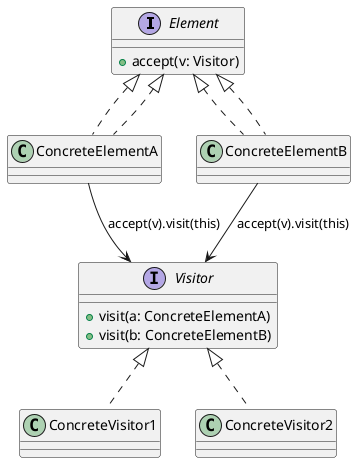

# Visitor — Behavioral Design Pattern (GoF)

## Pattern Name and Classification

**Visitor** — Behavioral pattern.

## Intent

Represent an operation to be performed on elements of an object structure. Visitor lets you define a new operation **without changing** the classes of the elements on which it operates (by using **double dispatch**).

## Also Known As

-   **Double Dispatch** (mechanism it relies on)

-   **Externalized Operations**

-   **Acyclic Visitor** (a common variation)


## Motivation (Forces)

-   You have a **stable object structure** (e.g., an AST, UI widget tree, file system model, product catalog).

-   You need to add **many unrelated operations** (pretty-print, evaluation, export, validation, metrics…) over that structure.

-   You want to keep each operation **cohesive** and separate from the element classes, avoiding fat classes and scattered logic.

-   You need **double dispatch**: dynamic behavior based on both the **element’s runtime type** and the **visitor type**.


**Trade-off:** It’s easy to add new visitors (new operations) but harder to add new element types (you must extend the visitor interface and update all visitors).

## Applicability

Use **Visitor** when:

-   The object structure is relatively **stable**; new operations arrive often.

-   You want to **accumulate state** or perform **cross-cutting** operations while traversing a composite.

-   You need to perform operations that **require type-specific logic** without proliferating `instanceof`/casts.


Avoid when:

-   The element hierarchy **changes frequently** (new node types often).

-   Operations are few and simple—Visitor may be overkill.


## Structure



## Participants

-   **Element**: defines `accept(Visitor)`.

-   **ConcreteElement**: implements `accept` by calling back `visitor.visit(this)`.

-   **Visitor**: declares `visit` methods for each concrete element.

-   **ConcreteVisitor**: implements the operation for each element type.

-   **Object Structure**: a collection or composite that can be traversed and visited.


## Collaboration

-   Client creates a **Visitor** and traverses the structure (or asks the structure to do it).

-   Each element calls back `visitor.visit(this)` — **double dispatch** selects the right overload based on both dynamic types.


## Consequences

**Benefits**

-   **Open–Closed** for operations: add a new operation by adding a new visitor class.

-   Keeps **element classes slim**; each operation is cohesive and testable.

-   Enables **accumulating results** across a traversal (e.g., metrics, cost, codegen).

-   Works well with **Composite** structures.


**Liabilities**

-   **Adding a new element type** requires editing the visitor interface and **all existing visitors**.

-   Breaks **encapsulation** if visitors need internal details; you may need privileged getters.

-   Boilerplate (many visit methods) unless mitigated (generic visitors, adapters, reflection, pattern matching).

-   Potential tight coupling between visitor and element APIs.


## Implementation

**Key tips**

1.  **Define the Visitor interface** with one `visit(Foo)` per concrete element.

2.  Elements implement `accept(Visitor v) { v.visit(this); }`.

3.  Provide **traversal** either in the structure (preferred with Composite) or in visitors.

4.  Consider a **generic result type** (`Visitor<R>`) to return values without side channels.

5.  Provide a **Default/Adapter Visitor** with empty methods to reduce boilerplate.

6.  For evolving models, consider **Acyclic Visitor** (each visitor implements only needed `visit` methods + dynamic dispatch via `instanceof`), or **pattern matching** (Java 21+ `switch` on sealed hierarchies) if Visitor is too heavy.

7.  Threading: keep visitor instances **stateless** or confine mutable aggregation fields.


**Variations**

-   **Acyclic Visitor** (no monolithic interface).

-   **Reflective Visitor** (one `visit(Object)` that reflectively dispatches).

-   **Functional Visitor** (lambdas map type → function).

-   **Sealed Hierarchy + Pattern Matching** (can be an alternative in modern Java).


## Sample Code (Java)

### Domain: Arithmetic Expression AST

Operations implemented as visitors: **evaluation** and **pretty-print**. Uses a **generic Visitor<R>** and a **base adapter**.

```java
// Expr.java — element hierarchy (Java 17+ sealed for clarity; works without 'sealed' too)
public sealed interface Expr permits Num, Var, Add, Mul {
    <R> R accept(ExprVisitor<R> v);
}

public record Num(double value) implements Expr {
    public <R> R accept(ExprVisitor<R> v) { return v.visitNum(this); }
}
public record Var(String name) implements Expr {
    public <R> R accept(ExprVisitor<R> v) { return v.visitVar(this); }
}
public record Add(Expr left, Expr right) implements Expr {
    public <R> R accept(ExprVisitor<R> v) { return v.visitAdd(this); }
}
public record Mul(Expr left, Expr right) implements Expr {
    public <R> R accept(ExprVisitor<R> v) { return v.visitMul(this); }
}
```

```java
// ExprVisitor.java — generic result type with a default adapter
public interface ExprVisitor<R> {
    R visitNum(Num n);
    R visitVar(Var v);
    R visitAdd(Add a);
    R visitMul(Mul m);

    // Adapter with sensible defaults; override what you need
    abstract class Adapter<R> implements ExprVisitor<R> {
        protected R unsupported(String kind) {
            throw new UnsupportedOperationException("No visit for " + kind);
        }
        public R visitNum(Num n) { return unsupported("Num"); }
        public R visitVar(Var v) { return unsupported("Var"); }
        public R visitAdd(Add a) { return unsupported("Add"); }
        public R visitMul(Mul m) { return unsupported("Mul"); }
    }
}
```

```java
// EvalVisitor.java — computes a numeric result from an expression
import java.util.Map;

public class EvalVisitor implements ExprVisitor<Double> {
    private final Map<String, Double> env; // variable assignments

    public EvalVisitor(Map<String, Double> env) { this.env = env; }

    public Double visitNum(Num n) { return n.value(); }

    public Double visitVar(Var v) {
        Double val = env.get(v.name());
        if (val == null) throw new IllegalArgumentException("Unbound var: " + v.name());
        return val;
    }

    public Double visitAdd(Add a) {
        return a.left().accept(this) + a.right().accept(this);
    }

    public Double visitMul(Mul m) {
        return m.left().accept(this) * m.right().accept(this);
    }
}
```

```java
// PrintVisitor.java — pretty printer with minimal parens
public class PrintVisitor implements ExprVisitor<String> {
    public String visitNum(Num n) { return trimZeros(n.value()); }
    public String visitVar(Var v) { return v.name(); }
    public String visitAdd(Add a) {
        return parenthesize(a.left(), 1) + " + " + parenthesize(a.right(), 1);
    }
    public String visitMul(Mul m) {
        return parenthesize(m.left(), 2) + " * " + parenthesize(m.right(), 2);
    }

    // precedence: + = 1, * = 2, literal/var = 3
    private String parenthesize(Expr e, int ctxPrec) {
        if (e instanceof Num || e instanceof Var) return e.accept(this);
        int p = (e instanceof Add) ? 1 : (e instanceof Mul) ? 2 : 3;
        String s = e.accept(this);
        return (p < ctxPrec) ? "(" + s + ")" : s;
    }

    private static String trimZeros(double d) {
        String s = Double.toString(d);
        return s.endsWith(".0") ? s.substring(0, s.length()-2) : s;
    }
}
```

```java
// Demo.java
import java.util.Map;

public class Demo {
    public static void main(String[] args) {
        // Build expression: (x + 2) * (x + 3)
        Expr expr = new Mul(new Add(new Var("x"), new Num(2)),
                            new Add(new Var("x"), new Num(3)));

        String printed = expr.accept(new PrintVisitor());
        double valueAt5 = expr.accept(new EvalVisitor(Map.of("x", 5.0)));

        System.out.println("Expr:  " + printed);         // (x + 2) * (x + 3)
        System.out.println("Value: " + valueAt5);        // 56.0

        // Add a NEW OPERATION without touching element classes:
        ExprVisitor<Boolean> hasVarX = new ExprVisitor.Adapter<>() {
            public Boolean visitNum(Num n) { return false; }
            public Boolean visitVar(Var v) { return "x".equals(v.name()); }
            public Boolean visitAdd(Add a) { return a.left().accept(this) || a.right().accept(this); }
            public Boolean visitMul(Mul m) { return m.left().accept(this) || m.right().accept(this); }
        };
        System.out.println("Mentions x? " + expr.accept(hasVarX)); // true
    }
}
```

**Why this shows Visitor’s value**

-   We added a **new operation** (`hasVarX`) by adding a new visitor only.

-   Evaluation & printing are **separate, testable** classes.

-   The AST (elements) remained unchanged.


> **Note:** If you add a new node type (e.g., `Pow`), you must extend `ExprVisitor` and update all existing visitors — the known drawback.

## Known Uses

-   **Compilers/Interpreters**: multiple passes over ASTs (type checking, constant folding, code gen).

-   **Serialization/Export**: visiting object graphs to produce JSON/XML/SQL/Markdown.

-   **Static Analysis/Linting**: visitors over syntax trees/bytecode (e.g., Checkstyle, PMD, Error Prone).

-   **GUI Frameworks**: operations over widget hierarchies (layout, painting, hit testing) when not built in.

-   **Modeling Frameworks**: EMF generated models ship with visitor hooks.


## Related Patterns

-   **Composite**: Visitor commonly traverses composites.

-   **Interpreter**: AST elements often used with visitors for different interpretations.

-   **Strategy**: alternative when you want runtime-pluggable behavior without double dispatch.

-   **Decorator**: augment elements; can be combined with Visitor to add cross-cutting info during traversal.

-   **Pattern Matching (sealed classes)**: modern alternative to Visitor when element set is **closed** and you accept switch expressions instead of double dispatch.

-   **Acyclic Visitor**: loosens coupling by avoiding a monolithic visitor interface.
