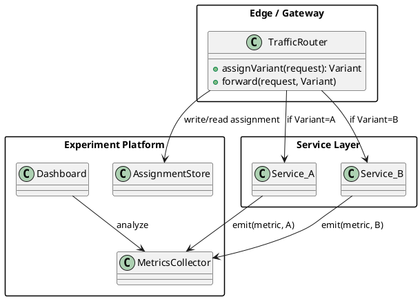

# A/B Testing — DevOps Deployment Pattern

## Pattern Name and Classification

**A/B Testing** — DevOps **Release & Experimentation** pattern for **progressive delivery** and **product validation**.

## Intent

Release two (or more) variants (A, B, …) of a service or feature to **randomly assigned, mutually exclusive** user cohorts; **measure impact** on predefined metrics; and use **statistical inference** to decide whether to roll out, iterate, or roll back.

## Also Known As

Online controlled experiments; Split testing; Bucket testing; Experimentation in production.

## Motivation (Forces)

-   You want to change behavior (UI, pricing, ranking, algorithm) but **don’t know** if it improves key metrics (conversion, latency, error rate, retention).

-   Stakeholders demand **evidence** over intuition.

-   Continuous delivery needs **guardrails** to prevent regressions.

-   You must balance:

    -   **Speed** (ship often) vs **Safety** (don’t tank KPIs).

    -   **Randomization** vs **Targeting** (e.g., only specific markets).

    -   **Consistency** (sticky treatment per user) vs **Operational simplicity**.


## Applicability

Use A/B Testing when:

-   You can define a **single success metric** (or a small set) and an **unambiguous hypothesis**.

-   You can **randomize** traffic and maintain **sticky assignment** (cookie, user id).

-   You can **observe** outcomes with low latency (telemetry/analytics in place).

-   The change is **reversible** or can run in parallel (multiple deploys, toggles, safe migrations).


Avoid when:

-   Very **low traffic** (underpowered study) or heavy **seasonality** you can’t block/stratify.

-   **Security/compliance** changes where differential exposure is inappropriate.

-   Irreversible data migrations or one-way side effects without isolation.


## Structure

Two or more variants deployed behind a router/edge or toggled within the app. Assignment is sticky and metrics are collected per variant.



## Participants

-   **Traffic Router** (CDN, API gateway, service mesh, app filter): Randomizes and **sticks** users to a bucket; forwards to the corresponding backend or feature branch.

-   **Variants** (A/B/…): Independently deployable versions or feature-flag branches.

-   **Assignment Store** (cookie, header, KV, identity service): Persists treatment so a user sees the same variant.

-   **Metrics/Telemetry**: Emits events tagged with the variant; powers analysis.

-   **Experiment Controller** (platform/feature flag service): Defines allocation, targeting, start/stop, and exposure rules.

-   **CI/CD**: Automates building, deploying, and scaling multiple variants.


## Collaboration

1.  Client request → **Router** computes/reads assignment → adds header/cookie.

2.  Router forwards to **Variant A or B** (or same service toggles feature).

3.  Variant emits **metrics** with assignment labels.

4.  **Analytics** aggregates per-variant KPIs; **experiment owner** decides.


## Consequences

**Benefits**

-   **Causal evidence** for product and performance changes.

-   **Risk containment**: bad variants impact only a cohort.

-   **Faster learning** versus long change cycles.

-   Pairs naturally with **feature flags** and **progressive delivery**.


**Liabilities**

-   Requires **instrumentation discipline** and stat expertise (power, significance, stopping rules).

-   **User fairness** and legal considerations (consent, data use).

-   Operational **cost**: extra replicas, dual infra paths.

-   **Sample contamination** risk (missing stickiness, bots, internal traffic).


## Implementation

**Key decisions**

-   **Unit of randomization**: user id (preferred), session, device, org/tenant.

-   **Stickiness**: hash(userId) → bucket; store in cookie/header.

-   **Traffic allocation**: 90/10 → 50/50 over time; allow **ramp** and **kill switch**.

-   **Targeting**: locale, platform, customer tier; keep **mutually exclusive** experiments or use namespaces.

-   **Metrics**: define **primary** (conversion/latency) and **guardrails** (errors, availability).

-   **Stats**: precompute **sample size** and duration; avoid peeking or use sequential tests; correct for multiplicity.

-   **Isolation**: avoid shared caches causing spillover; tag cache keys with variant if necessary.

-   **Observability**: propagate variant via headers to logs/traces.


**Where to implement**

-   **Edge** (NGINX/Envoy/CloudFront): split at layer 7; best for microservices/web.

-   **Service Mesh** (Istio/Linkerd): traffic shifting + headers for stickiness.

-   **In-App**: feature flag SDK + Strategy pattern around algorithm choice.


**Security & Privacy**

-   Don’t store PII in the assignment token.

-   Anonymize or hash identifiers; respect consent/DSGVO.


## Sample Code (Java)

### 1) Spring Boot: Sticky Assignment + Header Propagation (Servlet Filter)

Assigns users to A/B buckets, sets a cookie, and forwards a header `X-Experiment-Variant`. Metrics can then tag by header.

```java
// ExperimentFilter.java
import jakarta.servlet.*;
import jakarta.servlet.http.*;
import org.springframework.stereotype.Component;
import java.io.IOException;
import java.nio.charset.StandardCharsets;
import java.security.MessageDigest;
import java.util.Base64;

@Component
public class ExperimentFilter implements Filter {
    private static final String COOKIE = "exp_checkout_v2";
    private static final String HEADER = "X-Experiment-Variant";
    private static final String EXPERIMENT_ID = "checkout-v2";
    private static final int A_PERCENT = 50; // change for ramps (e.g., 90 -> 10)

    @Override
    public void doFilter(ServletRequest req, ServletResponse res, FilterChain chain)
            throws IOException, ServletException {
        HttpServletRequest http = (HttpServletRequest) req;
        HttpServletResponse httpRes = (HttpServletResponse) res;

        String variant = readVariant(http);
        if (variant == null) {
            String userKey = userKey(http); // from auth or fallback to client id
            int bucket = bucket(userKey);
            variant = (bucket < A_PERCENT) ? "A" : "B";
            setCookie(httpRes, variant);
        }

        // Propagate variant to downstream services & logs
        HttpServletRequest wrapper = new HttpServletRequestWrapper(http) {
            @Override public String getHeader(String name) {
                if (HEADER.equalsIgnoreCase(name)) return variant;
                return super.getHeader(name);
            }
        };
        httpRes.setHeader(HEADER, variant);
        httpRes.setHeader("X-Experiment-Id", EXPERIMENT_ID);

        chain.doFilter(wrapper, httpRes);
    }

    private String readVariant(HttpServletRequest req) {
        if (req.getCookies() == null) return null;
        for (Cookie c : req.getCookies()) {
            if (COOKIE.equals(c.getName())) return c.getValue();
        }
        return null;
    }

    private void setCookie(HttpServletResponse res, String variant) {
        Cookie c = new Cookie(COOKIE, variant);
        c.setHttpOnly(true);
        c.setPath("/");
        c.setMaxAge(60 * 60 * 24 * 30); // 30 days
        res.addCookie(c);
    }

    // Prefer a stable user id after auth; here: hash of IP+UA as fallback
    private String userKey(HttpServletRequest req) {
        String uid = (String) req.getAttribute("userId");
        if (uid != null) return uid;
        String ua = req.getHeader("User-Agent");
        String ip = req.getRemoteAddr();
        return ip + "|" + ua;
    }

    // Deterministic 0..99 bucket from key (SHA-256)
    private int bucket(String key) {
        try {
            MessageDigest md = MessageDigest.getInstance("SHA-256");
            byte[] digest = md.digest(key.getBytes(StandardCharsets.UTF_8));
            // use first 2 bytes for bucket
            int v = ((digest[0] & 0xFF) << 8) | (digest[1] & 0xFF);
            return v % 100;
        } catch (Exception e) {
            // fallback: random but not sticky
            return (int) (Math.random() * 100);
        }
    }
}
```

### 2) Strategy Wiring for the Variant Inside the Service

Pick the implementation based on the propagated header. This keeps controllers thin and makes the experiment explicit.

```java
// CheckoutStrategy.java
public interface CheckoutStrategy {
    CheckoutResult checkout(Cart cart);
}

// CheckoutA.java
public class CheckoutA implements CheckoutStrategy {
    @Override public CheckoutResult checkout(Cart cart) {
        // original behavior
        return new CheckoutResult("A", /* ... */);
    }
}

// CheckoutB.java
public class CheckoutB implements CheckoutStrategy {
    @Override public CheckoutResult checkout(Cart cart) {
        // new behavior (e.g., different pricing or payment flow)
        return new CheckoutResult("B", /* ... */);
    }
}
```

```java
// CheckoutController.java
import org.springframework.web.bind.annotation.*;
import jakarta.servlet.http.HttpServletRequest;

@RestController
@RequestMapping("/api/checkout")
public class CheckoutController {

    private final CheckoutStrategy a;
    private final CheckoutStrategy b;

    public CheckoutController() {
        this.a = new CheckoutA();
        this.b = new CheckoutB();
    }

    @PostMapping
    public CheckoutResult checkout(@RequestBody Cart cart, HttpServletRequest req) {
        String variant = req.getHeader("X-Experiment-Variant");
        CheckoutStrategy s = "B".equalsIgnoreCase(variant) ? b : a;
        long t0 = System.nanoTime();
        CheckoutResult r = s.checkout(cart);
        long durMs = (System.nanoTime() - t0) / 1_000_000;

        // Emit simple metrics (replace with real telemetry)
        System.out.printf("metric=checkout.duration variant=%s value_ms=%d%n", variant, durMs);
        return r;
    }
}
```

```java
// Simple models
public record Cart(String userId, int items, long subtotalCents) {}
public record CheckoutResult(String variant /* more fields here */) {}
```

### 3) (Optional) NGINX/Envoy Split at the Edge

**NGINX (split\_clients)**

```nginx
# Hash on cookie or user id header; default to $remote_addr
map $http_x_user_id $user_key { default $remote_addr; }
split_clients "${user_key}" $ab_bucket {
    50%     "A";
    *       "B";
}
map $http_cookie $has_cookie {
    default 0;
    "~*exp_checkout_v2=([AB])" 1;
}
map $http_cookie $variant {
    default $ab_bucket;
    "~*exp_checkout_v2=([AB])" $1;
}
proxy_set_header X-Experiment-Variant $variant;
proxy_set_header X-Experiment-Id "checkout-v2";
```

**Istio VirtualService (header-based routing)** – route to `svc-a` or `svc-b` using `X-Experiment-Variant`.

## Known Uses

-   E-commerce checkout and pricing variants.

-   Ranking/recommendation algorithms (search, feeds).

-   Onboarding and paywall flows in SaaS/mobile apps.

-   API behavior changes (e.g., dedup logic, retry policy) validated on a subset of tenants.


## Related Patterns

-   **Feature Toggle/Flag**: mechanism to turn variants on/off; A/B sits **on top** with assignment and analysis.

-   **Canary Release**: shifts traffic to a new version to validate **stability**, not user impact; can combine with A/B.

-   **Blue–Green**: two prod environments for **fast switch**; can host A and B if needed.

-   **Shadow Traffic**: mirror requests for safety checks; not shown to users, complements A/B.

-   **Strategy Pattern**: inside the app to implement variant logic cleanly.

-   **Circuit Breaker / Bulkhead**: guard resilience while experiments run.


---

### Practical Checklist

-   Hypothesis & success metric defined **before** starting.

-   Randomization unit and **sticky assignment** chosen.

-   Guardrail metrics & **kill switch** in place.

-   Required **sample size** and **duration** estimated.

-   Bot/internal traffic **excluded**; namespaces for concurrent experiments.

-   Variant label **propagated** end-to-end (logs, traces, metrics).

-   Post-experiment **decision rule** documented (rollout, iterate, retire).
