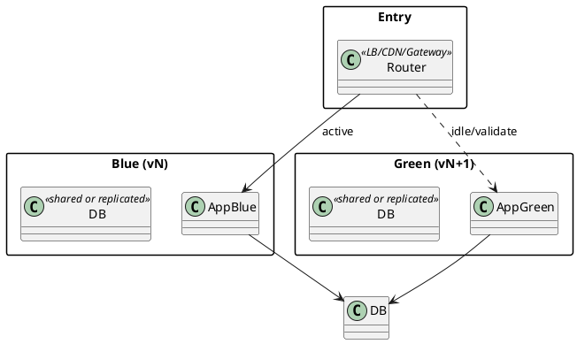

# Blue–Green Deployment — DevOps Deployment Pattern

## Pattern Name and Classification

**Blue–Green Deployment** — DevOps **Release & Traffic-Switching** pattern enabling zero/near-zero downtime releases.

## Intent

Run **two production environments**—**Blue** (live) and **Green** (idle/candidate)\*\*—that are functionally identical. Deploy the new version to the idle color, validate it, then **atomically switch traffic** to it. Keep the previous color on standby for a fast rollback.

## Also Known As

Red–Black (Netflix); Dual-stack deploy; Two-phase cutover; Parallel production.

## Motivation (Forces)

-   Need to **deploy frequently** with **zero downtime** and **fast rollback**.

-   Production-only concerns (config, data, scale, third-party deps) are hard to simulate; you want a **full-fidelity environment** to validate before exposure.

-   Balance:

    -   **Speed** (ship now) vs **Safety** (rollback instantly).

    -   **Simplicity** (binary switch) vs **Cost** (duplicate infra).

    -   **Consistency** (sticky sessions, cache warmup, DB migrations) vs **Operational overhead**.


## Applicability

Use Blue–Green when:

-   You can afford **duplicated runtime capacity** (at least temporarily).

-   You control a **traffic switch** (load balancer, CDN, API gateway, service mesh, DNS).

-   The service is **stateless** or session stickiness can be handled (shared session store).

-   DB schema changes are **backward compatible** during the switch (expand/contract).


Avoid or adapt when:

-   Large **stateful** components cannot be run in parallel.

-   One-way or **destructive migrations** make rollback impossible.

-   Cost or quota limits prohibit two full environments.


## Structure

Two identical stacks behind a single entrypoint. The **Router** points at exactly one “color” at a time; observability spans both.



## Participants

-   **Router** (LB/CDN/API gateway/Service Mesh): directs 100% of traffic to Blue *or* Green.

-   **Blue Environment**: current production.

-   **Green Environment**: candidate version.

-   **Shared Services**: DB, cache, queues, secrets; ideally **compatible** with both versions.

-   **Observability**: metrics, logs, traces across colors.

-   **Release Controller**: automation that deploys, validates, switches, and rolls back.


## Collaboration

1.  CI/CD deploys **Green** alongside **Blue**.

2.  Health checks, smoke tests, synthetic traffic, and backfills **warm up Green**.

3.  **Router flips** traffic to Green atomically (or near-atomically).

4.  Monitor guardrails (errors, latency, saturation).

5.  Keep **Blue** on standby; if issues, **flip back** instantly.

6.  Decommission the old color when safe.


## Consequences

**Benefits**

-   **Zero/near-zero downtime** cutover.

-   **Instant rollback** by flipping back.

-   Realistic **pre-production validation** in an identical stack.

-   Simple mental model vs. canary matrices.


**Liabilities**

-   **Double infra cost** during overlap.

-   Requires **backward-compatible** DB and API changes.

-   Risk of **state divergence** (sessions, caches) if not shared or warmed.

-   Flip can be **all-or-nothing** (less granular than canary).


## Implementation

**Core practices**

-   **Traffic switch**: LB target group swap, gateway route update, or service mesh `weight: 100/0 → 0/100`. Avoid slow DNS TTL unless you control caches.

-   **Health & readiness**: use **liveness** and **readiness** endpoints; only admit Green when ready.

-   **Session handling**: externalize sessions (Redis) or make endpoints stateless; ensure **sticky** cookies if needed.

-   **DB migrations**: apply **expand/contract**:

    1.  Add new columns/tables (expand) — both versions work.

    2.  Deploy Green using new schema.

    3.  Flip traffic.

    4.  Remove old columns (contract) later.

-   **Cache warmup**: pre-load or shadow traffic into Green to prevent cold starts.

-   **Observability**: tag metrics/logs with `color=blue|green` and `version`.

-   **Automate rollback**: one command/PR to flip back; keep Blue healthy until post-flip bake time passes.


**Where to switch**

-   **Load balancer** (ALB/NLB/ELB, HAProxy): swap target groups.

-   **API gateway/CDN** (NGINX/Envoy/CloudFront): switch upstream.

-   **Service mesh** (Istio/Linkerd): update `VirtualService` weights to 0/100.

-   **Kubernetes**: two Deployments (blue, green) behind one Service; change selector or use two Services and rebind Ingress.


**Safety checks**

-   Synthetic canaries, error budgets, SLOs as **guardrails**.

-   Block flip if **migration preconditions** fail.

-   Feature flags as **last-mile kill switches** inside the app.


---

## Sample Code (Java)

### 1) Spring Boot app: color/version endpoints, readiness, and graceful shutdown

```java
// ApplicationInfo.java
import org.springframework.beans.factory.annotation.Value;
import org.springframework.stereotype.Component;

@Component
public class ApplicationInfo {
    @Value("${app.color}") private String color;   // "blue" or "green"
    @Value("${app.version}") private String version;
    public String color() { return color; }
    public String version() { return version; }
}
```

```java
// InfoController.java
import org.springframework.web.bind.annotation.*;
import java.util.Map;

@RestController
public class InfoController {
    private final ApplicationInfo info;
    public InfoController(ApplicationInfo info) { this.info = info; }

    @GetMapping("/color")
    public Map<String,String> color() {
        return Map.of("color", info.color(), "version", info.version());
    }

    // Readiness: include lightweight checks that must pass before routing traffic
    @GetMapping("/ready")
    public Map<String,Object> ready() {
        boolean db = true;   // ping datasource or repo
        boolean cache = true;// ping cache
        boolean deps = true; // ping essential dependencies
        boolean ok = db && cache && deps;
        return Map.of("ok", ok, "db", db, "cache", cache, "deps", deps,
                      "color", info.color(), "version", info.version());
    }

    // Liveness
    @GetMapping("/live")
    public String live() { return "OK"; }
}
```

```java
// GracefulShutdownConfig.java
import org.springframework.context.annotation.Configuration;
import org.springframework.context.event.ContextClosedEvent;
import org.springframework.context.event.EventListener;

import java.util.concurrent.TimeUnit;

@Configuration
public class GracefulShutdownConfig {
    @EventListener
    public void onClosed(ContextClosedEvent e) throws InterruptedException {
        // Allow in-flight requests to finish before instance termination
        TimeUnit.SECONDS.sleep(5);
    }
}
```

```properties
# application.properties
app.color=green
app.version=1.7.3
server.shutdown=graceful
management.endpoints.web.exposure.include=health,info
```

**How it’s used**

-   Deploy two identical apps with different `app.color` values (Blue and Green).

-   The load balancer **checks `/ready`**; only flips to the color reporting `ok=true`.

-   After the flip, keep the other color running for the **bake period**, then retire.


### 2) Optional: Selector-based switch in Kubernetes (concept)

Two Deployments (labels `app=svc, color=blue|green`) and a single Service. Switch the Service selector:

```yaml
# service.yaml (flip selector from blue to green atomically)
apiVersion: v1
kind: Service
metadata: { name: checkout }
spec:
  selector:
    app: checkout
    color: green   # <-- change from blue to green to switch traffic
  ports:
    - port: 80
      targetPort: 8080
```

Readiness gates use `/ready`; liveness uses `/live`. Use `preStop` hook to drain:

```yaml
lifecycle:
  preStop:
    exec:
      command: ["sh","-c","sleep 5"]  # align with graceful shutdown
```

### 3) Optional: LB/Gateway flip (NGINX idea)

```nginx
# Blue–Green upstreams
upstream app_blue  { server blue-1:8080; server blue-2:8080; }
upstream app_green { server green-1:8080; server green-2:8080; }

# Single switch
map $blue_green_active $active_upstream {
  default app_blue;   # current
  app_green app_green;
}

server {
  listen 80;
  location / {
    proxy_pass http://$active_upstream;
    proxy_set_header X-App-Color $blue_green_active;
  }
}
```

Flip by setting `$blue_green_active` (via env/consul/template reload) and **reload NGINX** (no connection drop).

---

## Known Uses

-   **Netflix** (Red–Black) for rapid rollback.

-   **E-commerce** checkouts requiring zero downtime and immediate rollback.

-   **Payment gateways** and **identity providers** where session continuity matters.

-   **Internal platforms** rolling core services with strict SLOs.


## Related Patterns

-   **Canary Release**: shifts traffic gradually (1%→100%) instead of a binary flip.

-   **A/B Testing**: splits users for **experimentation**, not deployment safety.

-   **Rolling Update**: replaces pods/instances in place without a parallel stack.

-   **Shadow Traffic**: mirrors requests to the new version without serving responses.

-   **Feature Flags**: fine-grained toggles *inside* a version; pair with blue–green for last-mile safety.

-   **Database Expand/Contract**: migration strategy that enables safe flips.


---

### Practical Checklist

-   Separate **build** (immutable image) from **release** (flip time).

-   Health checks: `/live`, `/ready` with **real dependency checks**.

-   **Externalize sessions**; verify **sticky** behavior or statelessness.

-   **Schema compatibility** plan (expand/contract) & **data backfills**.

-   **Flip automation** with one command; **monitor guardrails** post-flip.

-   Keep previous color **on standby** until KPIs stabilize; then retire.
