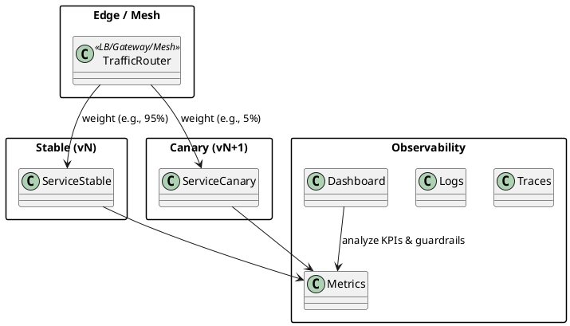

# Canary Release — DevOps Deployment Pattern

## Pattern Name and Classification

**Canary Release** — DevOps **Progressive Delivery & Traffic-Shifting** pattern.

## Intent

Roll out a new version to a **small, controlled percentage** of real production traffic first, observe **guardrail metrics** (errors, latency, saturation, business KPIs), and then **progressively increase** the share to 100% or roll back quickly if issues arise.

## Also Known As

Progressive rollout; Incremental release; Weighted routing; Traffic ramp; Phased rollout.

## Motivation (Forces)

-   Production is the only **full-fidelity** environment; you want early detection of regressions with **limited blast radius**.

-   Balance speed vs. safety: ship continuously without risking all users at once.

-   Need **observability-driven gates**: error budgets, SLOs, and business KPIs decide whether to continue ramp-up.

-   Prefer **granular control** (1% → 5% → 10% → 50% → 100%) instead of binary flips.


## Applicability

Use Canary Release when:

-   You can **route/weight** traffic at the LB/mesh/gateway or at least segment users deterministically (header/cookie/tenant).

-   Your system has **telemetry** (traces/logs/metrics) and clear **guardrails** and SLOs.

-   You can run **old and new** versions in parallel (backward compatible schema, compatible protocols).

-   You require **gradual** exposure (mobile, API, web, multi-tenant SaaS).


Avoid or adapt when:

-   Very **low traffic** (statistical power too weak) or high seasonality you can’t stratify.

-   **Irreversible** data changes (one-way migrations) or side-effects without isolation.

-   Hard multi-version constraints (exclusive locks, strict cache coupling) that prevent safe parallelism.


## Structure

Weighted routing progressively shifts traffic from Stable to Canary.



## Participants

-   **Traffic Router** (LB, CDN, API Gateway, Service Mesh): supports **weighted routing** and potentially **header-based stickiness**.

-   **Stable Service** (current prod, vN).

-   **Canary Service** (candidate, vN+1).

-   **Observability Stack**: metrics (Prometheus), logs, traces; alerts and dashboards.

-   **Release Controller**: CI/CD automation that updates weights, runs checks, promotes or rolls back.

-   **Feature Flags (optional)**: last-mile kill switches for risky code paths.


## Collaboration

1.  Deploy **canary** version alongside stable.

2.  Route a **small percentage** of traffic to the canary (e.g., 1–5%).

3.  Observe **technical and business** guardrails for a **bake period**.

4.  If healthy, **increase weight** stepwise; otherwise **roll back**.

5.  When canary reaches 100% and stabilizes, **decommission** the old version.


## Consequences

**Benefits**

-   **Minimized risk** with real traffic.

-   **Fine-grained control** over exposure and learning speed.

-   **Fast rollback** with small blast radius.

-   Natural fit for **SLO/error-budget**\-driven releases.


**Liabilities**

-   Requires **routing tech** that supports weights and stickiness.

-   Operational **complexity** (two versions live, metrics partitioning, automation).

-   **Statistical pitfalls**: peeking, insufficient sample size, contaminated cohorts.

-   Needs **schema compatibility** and dependency parity.


## Implementation

**Key decisions**

-   **Unit of segmentation**: user id, session, tenant, geo. Ensure **stickiness** to avoid flapping.

-   **Ramp plan**: e.g., 1% (15 min) → 5% (30 min) → 10% (1 h) → 25% (1 h) → 50% (2 h) → 100%.

-   **Guardrails** (must not worsen): error rate, p95 latency, resource saturation, business KPIs (conversion, click-through), plus **alert thresholds**.

-   **Roll back** criteria: precise thresholds and **automatic** rollback actions.

-   **Data/Schema**: use **expand/contract** migrations; keep both versions compatible during the canary.

-   **Observability**: label all telemetry with `version` or `track=stable|canary`.


**Where to implement**

-   **Service Mesh** (Istio/Linkerd): weighted `VirtualService` routes with headers for stickiness.

-   **LB/Gateway** (Envoy/NGINX/HAProxy/ALB): weight-based upstreams, cookie-based stickiness.

-   **In-App** (when infra can’t help): deterministic bucketing using headers/cookies and **Strategy** pattern to vary logic.


**Safety measures**

-   **Shadow traffic** (optional) before canary to warm caches and validate.

-   **Synthetic tests** and smoke checks after each ramp.

-   **Error budget** integration to pause/prematurely stop canary if burning too fast.

-   **Kill switches** (feature flags) to disable risky code paths instantly.


---

## Sample Code (Java)

### Spring Boot: Deterministic Canary Assignment + Header Propagation

This example shows **app-level** canary selection with sticky assignment. In practice you’d prefer LB/mesh weighting; this is useful when you must segment in-app (or to complement infra routing).

```java
// CanaryFilter.java
import jakarta.servlet.*;
import jakarta.servlet.http.*;
import org.springframework.stereotype.Component;
import java.io.IOException;
import java.nio.charset.StandardCharsets;
import java.security.MessageDigest;

@Component
public class CanaryFilter implements Filter {
    // Configurable via properties or toggles
    private static final String COOKIE = "track_checkout_canary";
    private static final String HEADER_TRACK = "X-Track";
    private static final String HEADER_VERSION = "X-App-Version";
    private static final int CANARY_PERCENT = 5; // start small; ramp via config

    private final String version;

    public CanaryFilter() {
        // In real code, @Value inject: app.version (e.g., v1.8.0-canary)
        this.version = System.getProperty("app.version", "v-canary");
    }

    @Override
    public void doFilter(ServletRequest req, ServletResponse res, FilterChain chain)
            throws IOException, ServletException {
        HttpServletRequest http = (HttpServletRequest) req;
        HttpServletResponse httpRes = (HttpServletResponse) res;

        String track = readCookie(http, COOKIE);
        if (track == null) {
            String key = userKey(http);      // auth user id preferred
            int bucket = bucket100(key);     // 0..99
            track = (bucket < CANARY_PERCENT) ? "canary" : "stable";
            setCookie(httpRes, COOKIE, track);
        }

        HttpServletRequest wrapper = new HttpServletRequestWrapper(http) {
            @Override public String getHeader(String name) {
                if (HEADER_TRACK.equalsIgnoreCase(name)) return track;
                return super.getHeader(name);
            }
        };
        httpRes.setHeader(HEADER_TRACK, track);
        httpRes.setHeader(HEADER_VERSION, version);

        chain.doFilter(wrapper, httpRes);
    }

    private static String readCookie(HttpServletRequest req, String name) {
        Cookie[] cs = req.getCookies();
        if (cs == null) return null;
        for (Cookie c : cs) if (name.equals(c.getName())) return c.getValue();
        return null;
    }
    private static void setCookie(HttpServletResponse res, String name, String value) {
        Cookie c = new Cookie(name, value);
        c.setHttpOnly(true);
        c.setPath("/");
        c.setMaxAge(60 * 60 * 24 * 30);
        res.addCookie(c);
    }
    private static String userKey(HttpServletRequest req) {
        // Prefer a stable authenticated user id; fallback is IP+UA (weaker)
        Object uid = req.getAttribute("userId");
        if (uid != null) return uid.toString();
        return req.getRemoteAddr() + "|" + req.getHeader("User-Agent");
    }
    private static int bucket100(String key) {
        try {
            MessageDigest md = MessageDigest.getInstance("SHA-256");
            byte[] d = md.digest(key.getBytes(StandardCharsets.UTF_8));
            int v = ((d[0] & 0xFF) << 8) | (d[1] & 0xFF);
            return v % 100;
        } catch (Exception e) {
            return (int) (Math.random() * 100);
        }
    }
}
```

```java
// CheckoutController.java
import org.springframework.web.bind.annotation.*;
import jakarta.servlet.http.HttpServletRequest;

@RestController
@RequestMapping("/api/checkout")
public class CheckoutController {

    private final CheckoutStrategy stable = new CheckoutStable();
    private final CheckoutStrategy canary = new CheckoutCanary();

    @PostMapping
    public CheckoutResult checkout(@RequestBody Cart cart, HttpServletRequest req) {
        String track = req.getHeader("X-Track");
        CheckoutStrategy impl = "canary".equalsIgnoreCase(track) ? canary : stable;

        long t0 = System.nanoTime();
        CheckoutResult r = impl.checkout(cart);
        long durMs = (System.nanoTime() - t0) / 1_000_000;

        // Minimal telemetry (replace with Micrometer/OTel)
        System.out.printf("metric=checkout.duration track=%s value_ms=%d%n", track, durMs);
        return r;
    }
}

// Strategy interfaces/impls (simplified)
interface CheckoutStrategy { CheckoutResult checkout(Cart cart); }
class CheckoutStable implements CheckoutStrategy {
    public CheckoutResult checkout(Cart cart) { return new CheckoutResult("stable", "OK"); }
}
class CheckoutCanary implements CheckoutStrategy {
    public CheckoutResult checkout(Cart cart) { return new CheckoutResult("canary", "OK + new flow"); }
}
record Cart(String userId, int items, long subtotalCents) {}
record CheckoutResult(String track, String message) {}
```

```properties
# application.properties
# Start with 1–5% canary by building with:
#   -Dapp.version=v1.8.0-canary -DCANARY_PERCENT=5 (or externalize via env)
management.endpoints.web.exposure.include=health,info
server.shutdown=graceful
```

**How to use this**

-   Start with `CANARY_PERCENT=1..5`.

-   Watch metrics labeled by `track` and `X-App-Version`.

-   Increase `CANARY_PERCENT` progressively (config flag or redeploy) until 100%, then retire the stable version.


### Infra-first options (recommended in production)

-   **Istio VirtualService** (weights):


```yaml
apiVersion: networking.istio.io/v1beta1
kind: VirtualService
metadata: { name: checkout }
spec:
  hosts: ["checkout.svc.cluster.local"]
  http:
    - route:
        - destination: { host: checkout, subset: stable }
          weight: 95
        - destination: { host: checkout, subset: canary }
          weight: 5
```

-   **NGINX/Envoy/ALB**: two upstreams with weights, cookie stickiness, and headers to tag logs.


---

## Known Uses

-   Large SaaS platforms rolling backend APIs with **SLO guardrails**.

-   E-commerce/ranking systems validating algorithm updates on **small cohorts** first.

-   Mobile backend toggles where client diversity requires gradual server-side rollout.

-   Payments, auth flows with **tenant-by-tenant** or region-by-region canaries.


## Related Patterns

-   **Blue–Green Deployment**: binary switch (0%/100%); canary is **gradual**.

-   **A/B Testing**: experiments for **product metrics**; canary focuses on **stability/SLOs**, though business KPIs may also be monitored.

-   **Feature Flags**: fine-grained toggles inside a version; pair with canary for last-mile safety.

-   **Shadow Traffic**: mirror requests to validate before serving real users.

-   **Circuit Breaker / Bulkhead**: resilience guards during canaries.

-   **Database Expand/Contract**: schema technique enabling safe multi-version operation.


---

### Practical Checklist

-   Define **ramp plan** and **automatic rollback** thresholds (error rate, p95 latency, saturation, key KPIs).

-   Ensure **stickiness** for fairness and cache consistency.

-   Tag all telemetry with **track/version**; build dashboards comparing stable vs. canary.

-   Use **backward-compatible** APIs/DB; plan cleanup after full rollout.

-   Keep **feature flags** ready to disable risky paths instantly.
